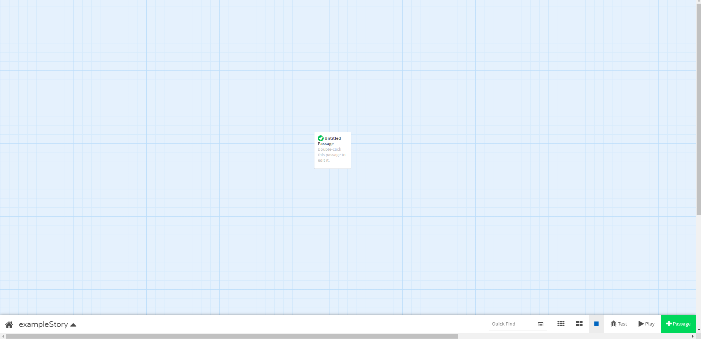
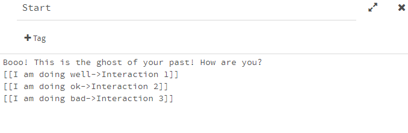

## Twine

We used [Twine](https://twinery.org/) to generate the story-based gamely in the application.

### Initial Setup

To export it to JSON format after creating the sotry you would have to add it manually as Twine does not support JSON export by default (Credits: [Twison](https://github.com/lazerwalker/twison)). If you have already added the JSON export format, skip to [Creating a Story](#creating-a-story).

1. Open the [Twine 2](https://twinery.org/2/#!/stories) online editor.
2. Click on 'Formats' button location on the right-hand side of the screen.
3. Select the 'Add a New Format.
4. Copy the following `https://lazerwalker.com/twison/format.js`and paste it into add a story format input field and press Add.
5. Select 'Twison 0.0.1 by Mike Lazer-Walker' at the end of the story formats list.

#### Note
* If you want to test your story in the browser you can change the export format to 'Harlowe 3.1.0' and click 'Play'. Then you will be able to test your story in the browser iteself.
* Twine does not have user accounts and cloud storage. It works on local browser cookies. It saves your stories by default in your browser cookies but you can also click on 'Publish to File' in the bottom bar in the menu which pops up after clicking on the name of your story. You can then import this file later in a different browser using Twine and continue your work!

You are all set to start creating an awesome ghost story!

### Creating a Story 

**Note**: The following steps should be applied to *each individual level*. That is, each level should have its own Twine JSON file created and they are not in the same graph. Please see the `story/1` directory for an example.

1. Click on the 'new story' button on the right, give your story a name and click on 'Add'.
2. You will be directed to a new screen similar to the one shown below. This is your workspace for Twine where you can edit and add new elements to your story. 
3. Each box, as shown in the picture below, can be treated as an interaction scene between the player and the ghost. The green rocket symbol on the top left indicates that this is the starting point of the story. You get various options after clicking on the box like delete, edit and play.  
4. Go ahead and click on the 'pencil icon' shown in the image above. This will open up the edit window of the box. 
5. The edit window will look like the image shown below. It has a heading on top and a message/interaction space in its body.  
6. Make sure to give a meaningful heading/title to the scene boxes which would describe the conversation that would take place in that particular scene. A good practice should be to keep it short. 
7. Next step is to add interaction links which will create more scene boxes and progress the story further. In the picture below, I have filled out the starting scene box with some example interaction with the ghost and the player. 
8. As shown in the picture above, you should follow these writing conventions while making an interaction.
   - The message that the ghost is saying/replying to the user choice should always be on the first line.
   - Enter each subsequent user reply to that message should be in a new line.
   - To link a user reply to a new/existing scene box, use the following format `[[Reply to the ghost->Name of the scene box to link]]`
9. This is what your workspace should look like after you have added three replies to the ghost message in the 'Start' scene box. 

10. Next, we need to update the possible user responses to the ghost's prompt. While the conversion script determines the response button text by the non-bracketed text in the main text box, its title should be the same. You must also add 3 tags per user response, to be listed next. Keep in mind that every user response can only be attached to one ghost response, so in user response nodes there should only be one linked node.
11. The three required user response tags are `type`, `effect`, and `points`, and they are set as pictured with their values separated by an `=`.
 - `points` is the amount of points a given user response gives, and I have largely used `0` for a not-good response, `2` or `3` or "okay" responses, and `5` for the best response. I have occasionally used `1`: all that is important is no points values are negative.
 - `effect` is not currently used for anything, but its purpose is to allow for penalties for very bad responses. In almost every case `effect=0`, however if you feel a particular response is deserving of punishment it can be `-1` for bad and `-2` for the worst. The intent with these is to slow the rate at which points are earned by some percentage.
 - `type` is also not currently used and in almost every case `type=0`. `type=0` = regular text, while `type=1` will make the text italic. `1` should only be used for actions like `you hear a ghost cackle`
12. Your Twine should now look something like this. It is reasonable and fine to have the `Ghosts aren't flammable!` user response link back to, say, the root node for example to allow the user to try again. If you do this be cognizant of the points these responses can give. It may open the possibility that a user could click through a response loop and gain infinite points, so set points to `0` in these cases.
13. After you are satisfied by the story you can export it to JSON simply by clicking on the play button on the bottom left part of the screen. This will open up a new tab with the JSON representation of the story you just created.

These are the basic functionalities you need to create complex non-linear stories and export it to JSON for integration in the application. The next section will have more information of the generated JSON format.

### Convert JSON Format to SQL Statements

Having retrieved the JSON file of, you should:

1. Rename the JSON file to `<level>.json`, e.g. `1.json` if the file is for level 1.
2. Put it into its respective ghost directory in the `story/` directory. For Ghost 2, this is `story/2`
3. You can then run the python conversion script to convert it. Brief documentation for it is supplied in the `story/README.md`
4. After you have converted all of your JSON into SQL statements, follow the general format of `lib/db/ghost1_story.dart` and its callee in `db.dart` to load it into the database.
5. Now wasn't that easy! 👀

